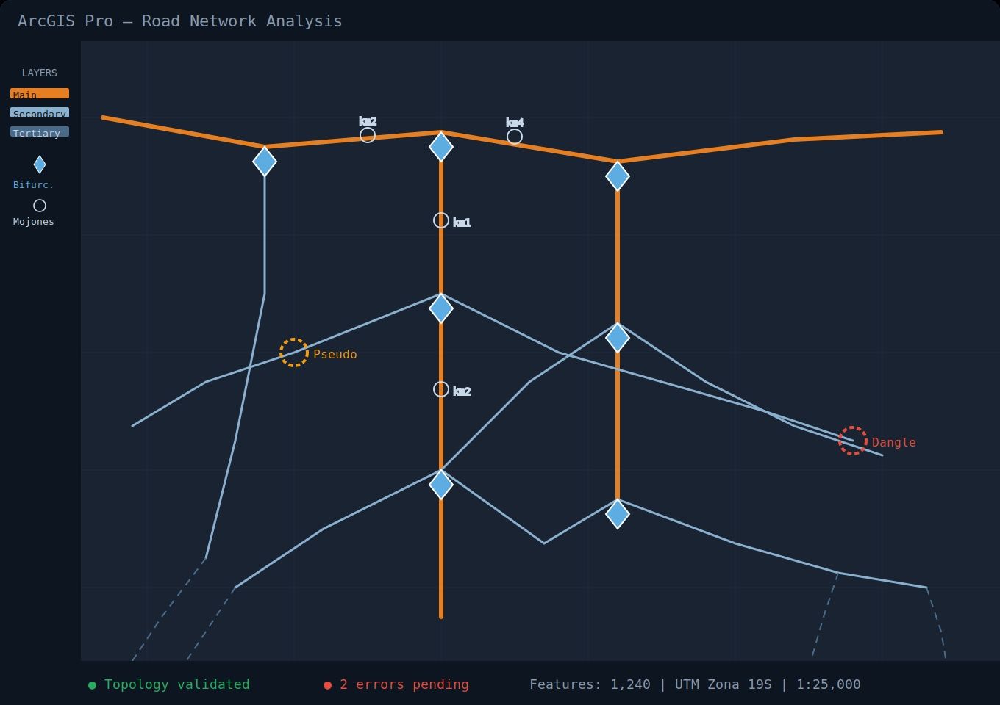
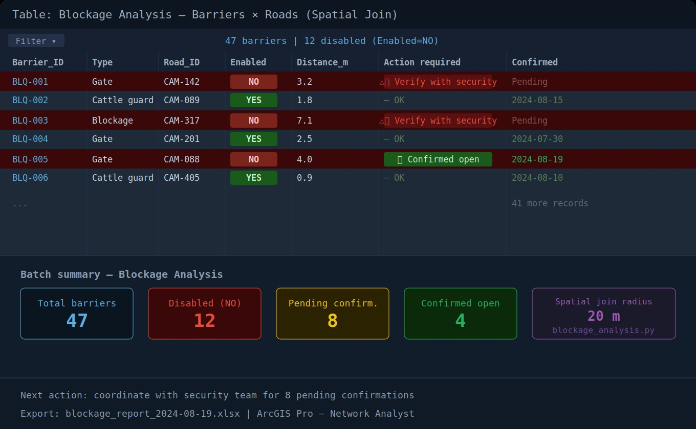

# 🛣️ Road Network Management — GIS

<p align="center">
  
  
  
  
  
</p>

<p align="center">
End-to-end GIS workflow for industrial road network management —<br>
data model, topology validation, Network Dataset construction,<br>
road blockage analysis and routing verification using ArcGIS Pro.
</p>

---

## 📌 Project Description

This project covers the full lifecycle of a road network GIS dataset applied to
industrial access roads: from the data model definition and feature editing standards,
through topology validation and geometry correction, up to Network Dataset
construction for routing analysis and road blockage detection.

Two main modules are covered:

- **Road Network Analysis** — data model, editing standards, topology rules,
  geometry QC and Network Dataset construction
- **Road Blockage Analysis** — detection and analysis of barriers (gates, cattle guards)
  and access restrictions affecting network routing

---

## 🗺️ Road Network Overview

<p align="center">
  
</p>

---

## 🚧 Blockage Analysis — Barrier Detection

<p align="center">
  
</p>

---

## 🗂️ Data Model

### Feature Classes

| Feature Class | Geometry | Description |
|---|---|---|
| Roads (`FC_Cam_Caminos`) | Polyline | Main and secondary road segments |
| Bifurcations (`FC_Cam_Bifurcaciones`) | Point | Junction nodes between road segments |
| Kilometer markers (`FC_Cam_Mojones`) | Point | Distance reference points along roads |
| Road works (`FC_Cam_Obras`) | Point | Bridges, culverts and road infrastructure |
| Blockages (`FC_Cam_Bloqueos`) | Point | Permanent or temporary access restrictions |
| Turns (`FC_Cam_Giros`) | Turn feature | Allowed/restricted turn rules at intersections |

### Road Attribute Standard

| Field | Description | Values / Rules |
|---|---|---|
| `Road_ID` | Unique road identifier | Consecutive integer |
| `Name` | Road name or bifurcation label | Bifurcación 1 / Bifurcación 2 / named roads |
| `Hierarchy` | Road classification | Main / Secondary / Tertiary |
| `Surface` | Road surface type | Asphalt / Gravel / Earth |
| `Endpoint_1` | Origin bifurcation ID | Must match existing bifurcation |
| `Endpoint_2` | Destination bifurcation ID | Must match existing bifurcation |
| `Enabled` | Operational status | YES / NO |
| `Width_m` | Road width in meters | Default: 8m for secondary roads |
| `Direction` | Allowed traffic direction | 00 = both / 01 = E1→E2 / 10 = E2→E1 |
| `Security` | Security access required | YES / NO |
| `Slope` | Road slope | Default: 0 |
| `Jurisdiction` | Road administrative level | National / Provincial / Local / Internal |

### Jurisdiction Classification

| Value | Description |
|---|---|
| `National` | National highways |
| `Provincial` | Provincial routes |
| `Local` | Municipal / communal roads |
| `Internal` | Wells and installations access roads |

> Roads to wells inherit width and jurisdiction from the access road
> connecting to the well location.

---

## ⚙️ Workflow

```text
STAGE 1 — DATA MODEL SETUP
Feature Dataset in GDB + shared CRS
Feature Classes: Roads, Bifurcations, Markers, Works, Blockages, Turns
        │
        ▼
STAGE 2 — ROAD EDITING
Digitizing traces + attribute completion
Endpoint assignment (Endpoint_1 / Endpoint_2 ↔ Bifurcation IDs)
Hierarchy, surface, width, jurisdiction per editing standard
        │
        ▼
STAGE 3 — TOPOLOGY VALIDATION
8 topology rules applied
Dangle detection · Self-intersection · Overlap · Pseudo nodes
        │
        ▼
STAGE 4 — GEOMETRY QC
Check Geometry → geometry error table
Count Overlapping Features → overlap detection
Manual correction + re-run until clean
        │
        ▼
STAGE 5 — NETWORK DATASET BUILD
Network Dataset construction in ArcGIS Pro
Turn restrictions + edge weights + connectivity rules
        │
        ▼
STAGE 6 — ROUTING VERIFICATION
Analysis > Network Analysis > Route
Start/end points → Run → verify optimal path
Blockage / barrier status check
        │
        ▼
STAGE 7 — BLOCKAGE ANALYSIS
Spatial join: barriers (gates, cattle guards) × roads
Identify enabled/disabled status
Export report for security coordination
```

---

## 🔷 Topology Rules

Eight topology rules are applied to validate the road network:

| Rule | Applied to | Error type |
|---|---|---|
| Must Not Overlap | Roads | Line error where segments overlap |
| Must Not Intersect | Roads | Line error (overlap) + point error (crossing) |
| Must Not Intersect With | Roads × Roads | Cross-layer intersection check |
| Must Not Have Dangles | Roads | Point error at unconnected endpoints |
| Must Not Have Pseudo Nodes | Roads | Node connecting exactly two segments |
| Must Be Single Part | Roads | Multipart geometry detected |
| Must Not Self Overlap | Roads | Self-intersecting segment |
| Endpoint Must Be Covered By | Roads → Bifurcations | Road endpoint not covered by a bifurcation |

See [`docs/topology-rules.md`](docs/topology-rules.md) for detailed explanations and correction procedures.

---

## 🧹 Geometry QC

### Check Geometry

Detects structural geometry problems in the road feature class.

**Key geometry problem codes:**

| Code | Description | Action |
|---|---|---|
| `NEEDS_REORDERING` | Shape must be reordered or duplicate points removed | Repair Geometry |
| `SE_SELF_INTERSECTING` | Line or polygon boundary self-intersects | Manual edit |
| `SE_TOO_FEW_POINTS` | Point count below required minimum | Delete and re-digitize |
| `SHORT_SEGMENT` | Segment below XY tolerance threshold | Accept or increase XY tolerance |

> Short segment warnings can often be accepted — they result from ArcGIS precision
> limitations, not editing errors. Recommended XY tolerance: 0.005–0.01 m.

### Count Overlapping Features

Detects overlapping road segments by counting feature overlap.

```
COUNT_ > 1  →  overlapping geometry detected  →  manual correction required
COUNT_ = 1  →  no overlap  →  pass
```

---

## 🚧 Blockage Analysis

Road barriers (gates, cattle guards, blockages) affect routing by disabling
road segments or junctions. The blockage analysis workflow:

1. Load road layer + barrier layers (gates, cattle guards)
2. Spatial join: barriers × road segments (within tolerance)
3. Check `Enabled` attribute on barriers and adjacent roads
   - `Enabled = NO` → generates routing detour
   - Coordinate with security team to confirm actual status
4. Update GIS: barriers + road `Enabled` field
5. Re-run routing verification to confirm resolution

See [`scripts/blockage_analysis.py`](scripts/blockage_analysis.py) for automated detection.

---

## 🔀 Routing Verification

After any road network update, routing is verified using the Network Dataset:

1. `Analysis > Network Analysis > Route`
2. Create origin and destination stop points
3. Run route → inspect generated path
4. If detour is unexpected: run Check Geometry + Count Overlapping
5. Check bifurcation `Enabled` field and endpoint IDs
6. After fix: remove routing layers (Discard changes) to keep project clean

---

## 🛠️ Tech Stack

| Tool | Usage |
|---|---|
| **ArcGIS Pro** | Editing, topology validation, Network Dataset, routing |
| **ArcGIS Network Analyst** | Route analysis, blockage impact assessment |
| **arcpy (Python)** | Geometry checks, blockage detection, QC automation |
| **Excel / Power BI** | QA/QC reporting, blockage status tracking |

---

## 📁 Repository Structure

```
gis-road-network-management/
│
├── README.md
├── .gitignore
│
├── assets/
│   └── screenshots/
│       ├── 01-road-network-view.jpg
│       └── 02-blockage-analysis.jpg
│
├── diagrams/
│   └── road-network-workflow.drawio
│
├── docs/
│   ├── topology-rules.md
│   ├── road-data-model.md
│   └── blockage-analysis-guide.md
│
└── scripts/
    ├── check_road_geometry.py
    └── blockage_analysis.py
```

---

## 🧠 Key Learnings

- Designing road network data models for industrial access road management
- Applying topology rules to maintain geometric and spatial integrity
- Building and maintaining Network Datasets for operational routing
- Detecting and resolving road blockages affecting field navigation apps
- Geometry QC workflows using Check Geometry and Count Overlapping Features

---

## 👩‍💻 Author

**Denise Hernández**  
GIS Analyst | Spatial Data | Network Analysis  
[](https://www.linkedin.com/in/denise-hern%C3%A1ndez-a3071968/)
[](https://quickest-stream-2d8.notion.site/Portafolio-GIS-Denise-Hern%C3%A1ndez-3069dd2d2c5781cd9539e5bdc0ba14fe?pvs=74)
